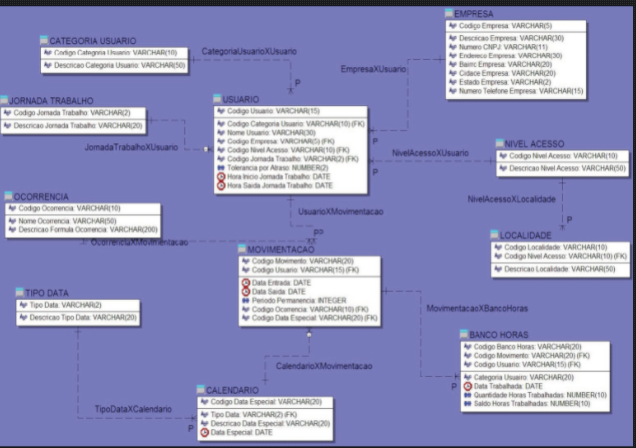
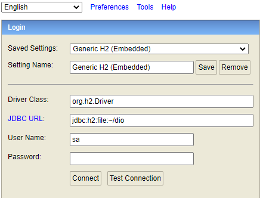
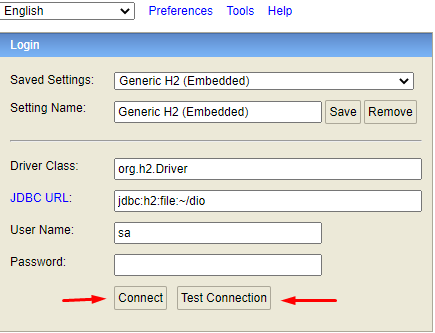
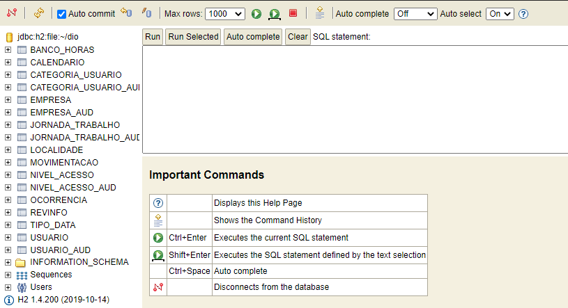
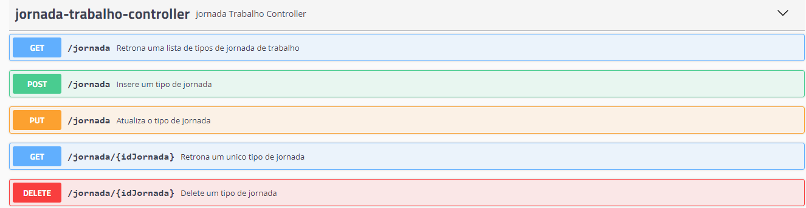
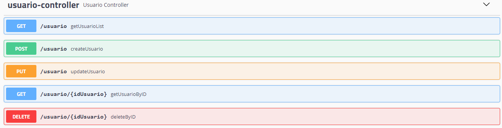
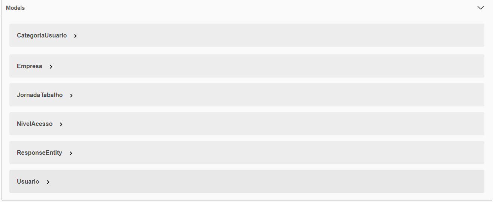

# Sistema de controle e ponto de acesso

## Diagrama do projeto

<h1 align="center">
    
</h1>

### Para acessar o banco de dados

Para acessar o banco necessário fazer o start do projeto executando o comando: gradle run ou gradle bootRun console. Após isso para acessar o banco de dados necessário copiar o caminho: *http://localhost:8081/h2* após isso você será redirecionado para uma página como essa abaixo:

<h1 align="center">
    
</h1>

Após isso você pode acessar o banco ou testar a conexão clicando em:

<h1 align="center">
    
</h1>

Depois de acessar o banco vai deparar com todas as relações criadas, conforme abaixo:

<h1 align="center">
    
</h1>


### Para acessar a documentação do feita com o swagger

Após startar o projeto necessário somente copiar essa url *http://localhost:8081/swagger-ui.html#/* no navegador de sua prefêrencia. Após isso você vai se deparar com uma tela parecida com essa:

<h1 align="center">
    
</h1>


<h1 align="center">
    
</h1>

<h1 align="center">
    
</h1>


## 🔖&nbsp; Sobre

Neste projeto desenvolvi uma API Rest para controle de ponto e acesso dos usuários de uma empresa.

---

## 🚀 Tecnologias utilizadas

O projeto foi desenvolvido utilizando as seguintes tecnologias

- [Java]
- [Gradle]
- [Spring-boot]
- [Hibernate]
- [Lombok]
- [Swagger]

---

## 🗂 Como baixar o projeto

```bash

    # Clonar o repositório
    $ git clone https://github.com/http-otavio/Sistema-Controle-de-Acesso

    # Entrar no diretório
    $ cd Sistema-Controle-de-Acesso

    # Entrar no diretório
    $ cd Projeto-Spring-Boot-Otavio

    # Instalar as dependências
    $ gradle install

    # Iniciar o projeto
    $ $ gradle run
```

---

Desenvolvido por Otávio Messias
